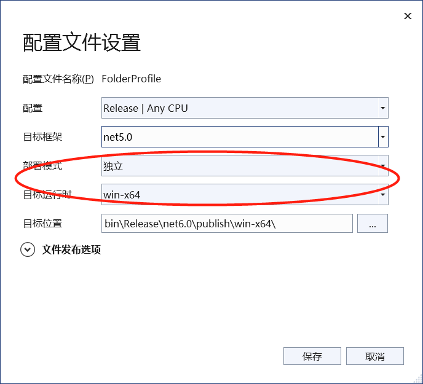

# AdvanceLog

> 高级日志库，包含高级日志动态库、基础日志动态库、高级日志查阅工具。
>
> 用于前端统一日志格式，以及提高日志的查阅效率。

## 仓库组成

| 路径               | 名称           | 说明                                                         |
| ------------------ | -------------- | ------------------------------------------------------------ |
| .\AdvanceLogLib    | 高级日志类     | 用于写入与获取日志，**基于.Net Standard 2.1**                |
| .\AdvanceLogReader | 高级日志阅读器 | 用于阅读高级日志信息，支持并列查询和文本检索，**基于.Net 5.0及AvaloniaUI，适用于Win7及以上系统和主流Linux系统** |
| .\BaseLogLib       | 基础日志类     | 按照格式写基础的*.txt格式的日志，**基于.Net Standard 2.1**   |

## 使用说明

仓库克隆后，在需要引入使用的项目中添加引用即可。低于运行时要求时，日志类可以通过复制代码源文件的方式添加使用。阅读器必须使用.Net 5.0以上，可以通过**单独发布对应平台包含独立运行时**的方式（见下图）进行对旧版本软件的兼容。

## 常用接口

基础日志类：

*BaseLogLib.BaseLog.WriteLog(LogType logType, string module, string func, string desc);*

> LogType level：日志级别，共有从低到高INFO、WARN、ERROR、DEBUG四级，适用范围请参阅代码注释
>
> string module：模块名，一般是触发的类名
>
> string func：函数名，一般是触发的函数名
>
> string desc：日志内容

高级日志类：

*AdvanceLogLib.AdvanLog.WriteLog(LogType logType, string module, string func, string desc);*

> LogType logType：日志级别，共有从低到高INFO、WARN、ERROR、DEBUG四级，适用范围请参阅代码注释
>
> string module：模块名，一般是触发的类名
>
> string func：函数名，一般是触发的函数名
>
> string desc：日志内容